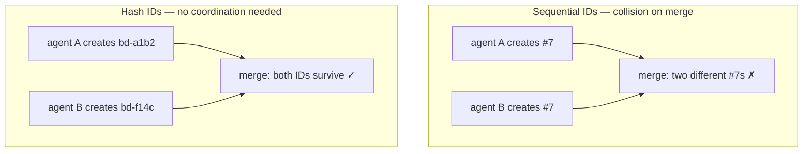

> Source: https://beads.gascity.com/core-concepts/hash-ids.md

> ## Documentation Index
> Fetch the complete documentation index at: https://beads.gascity.com/llms.txt
> Use this file to discover all available pages before exploring further.

# Hash-based IDs

> Why beads uses collision-resistant hash IDs like bd-a1b2 so agents and branches never clash

Understanding beads' collision-resistant ID system.

## The Problem

Traditional sequential IDs (`#1`, `#2`, `#3`) break when:

* Multiple agents create issues simultaneously
* Different branches have independent numbering
* Forks diverge and later merge



## The Solution

Beads uses hash-based IDs:

```
bd-a1b2c3    # Short hash
bd-f14c      # Even shorter
bd-a3f8e9.1  # Hierarchical (child of bd-a3f8e9)
```

**Properties:**

* Globally unique (content-based hash)
* No coordination needed between creators
* Merge-friendly across branches
* Predictable length (configurable)

## How Hashes Work

IDs are generated from:

* Issue title
* Creation timestamp
* Random salt

```bash theme={null}
# Create issue - ID assigned automatically
bd create "Fix authentication bug"
# Returns: bd-7x2f

# The ID is deterministic for same content+timestamp
```

## Hierarchical IDs

For epics and subtasks:

```bash theme={null}
# Parent epic
bd create "Auth System" -t epic
# Returns: bd-a3f8e9

# Children auto-increment
bd create "Design UI" --parent bd-a3f8e9    # bd-a3f8e9.1
bd create "Backend" --parent bd-a3f8e9      # bd-a3f8e9.2
bd create "Tests" --parent bd-a3f8e9        # bd-a3f8e9.3
```

Benefits:

* Clear parent-child relationship
* No namespace collision (parent hash is unique)
* Up to 3 levels of nesting

## ID Configuration

Configure ID prefix and length:

```bash theme={null}
# Set prefix (default: bd)
bd config set id.prefix myproject

# Set hash length (default: 4)
bd config set id.hash_length 6

# New issues use new format
bd create "Test"
# Returns: myproject-a1b2c3
```

## Collision Handling

While rare, collisions are handled automatically:

1. On import, if hash collision detected
2. Beads appends disambiguator
3. Both issues preserved

```bash theme={null}
# Check for collisions
bd info --schema --json | jq '.collision_count'
```

## Working with IDs

```bash theme={null}
# Partial ID matching
bd show a1b2     # Finds bd-a1b2...
bd show auth     # Fuzzy match by title

# Full ID required for ambiguous cases
bd show bd-a1b2c3d4

# List with full IDs
bd list --full-ids
```

## Migration from Sequential IDs

If migrating from a system with sequential IDs:

```bash theme={null}
# Bootstrap from a JSONL export (preserves original IDs in metadata)
bd init --from-jsonl old-issues.jsonl

# View original ID
bd show bd-new --json | jq '.original_id'
```

## Best Practices

1. **Use short references** - `bd-a1b2` is usually unique enough
2. **Use `--json` for scripts** - Parse full ID programmatically
3. **Reference by hash in commits** - `Fixed bd-a1b2` in commit messages
4. **Let hierarchies form naturally** - Create epics, add children as needed
