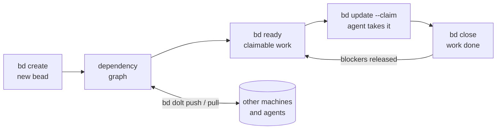

> Source: https://raw.githubusercontent.com/gastownhall/beads/main/README.md

# bd - Beads

**Distributed graph issue tracker for AI agents, powered by [Dolt](https://github.com/dolthub/dolt).**

**Platforms:** macOS, Linux, Windows, FreeBSD

[](LICENSE)
[](https://goreportcard.com/report/github.com/steveyegge/beads)
[](https://github.com/gastownhall/beads/releases)
[](https://www.npmjs.com/package/@beads/bd)
[](https://pypi.org/project/beads-mcp/)

**Docs:** https://beads.gascity.com/

Beads provides a persistent, structured memory for coding agents. It replaces messy markdown plans with a dependency-aware graph, allowing agents to handle long-horizon tasks without losing context.



## ⚡ Quick Start

```bash
# Install beads CLI (system-wide - don't clone this repo into your project)
curl -fsSL https://raw.githubusercontent.com/gastownhall/beads/main/scripts/install.sh | bash

# Initialize in YOUR project
cd your-project
bd init

# Optional: refresh or install richer instructions for your agent
bd setup codex    # Codex CLI - installs skill, AGENTS.md guidance, and hooks
bd setup claude   # Claude Code - installs hooks/settings
bd setup factory  # Factory.ai Droid - creates/updates AGENTS.md
```

**Note:** Beads is a CLI tool you install once and use everywhere. You don't need to clone this repository into your project.

`bd init` creates or updates `AGENTS.md` by default so agents can discover the beads workflow, and also installs project Claude/Codex integrations unless you pass `--skip-agents` or `--stealth`. Use `bd setup --list` to see supported integrations, including `bd setup codex`, `bd setup factory`, `bd setup claude`, `bd setup mux`, `bd setup cursor`, and more. See [Agent and IDE setup](docs/getting-started/ide-setup.md).

Manual copy-paste is only for unsupported agents, existing projects where you cannot rerun `bd init`/`bd setup`, or custom instruction files. In those cases, run `bd onboard` and paste the printed snippet into the file your agent reads.

If your agent is not covered by `bd setup`, add this minimal `AGENTS.md` section:

```markdown
This project uses bd (beads) for issue tracking.

- Run `bd prime` for workflow context and command guidance.
- Use `bd ready`, `bd show <id>`, `bd update <id> --claim`, and `bd close <id>`.
- Use `bd remember "insight"` for persistent project memory; do not create MEMORY.md files.
- Do not use markdown TODO lists for task tracking.
```

## 🛠 Features

* **[Dolt](https://github.com/dolthub/dolt)-Powered:** Version-controlled SQL database with cell-level merge, native branching, and built-in sync via Dolt remotes.
* **Agent-Optimized:** JSON output, dependency tracking, and auto-ready task detection.
* **Zero Conflict:** Hash-based IDs (`bd-a1b2`) prevent merge collisions in multi-agent/multi-branch workflows.
* **Compaction:** Semantic "memory decay" summarizes old closed tasks to save context window.
* **Messaging:** Message issue type with threading (`--thread`), ephemeral lifecycle, and mail delegation.
* **Graph Links:** `relates-to`, `duplicates`, `supersedes`, and `replies-to` for knowledge graphs.

## 📖 Essential Commands

| Command | Action |
| --- | --- |
| `bd ready` | List tasks with no open blockers. |
| `bd create "Title" -p 0` | Create a P0 task. |
| `bd update <id> --claim` | Atomically claim a task (sets assignee + in_progress). |
| `bd dep add <child> <parent>` | Link tasks (blocks, related, parent-child). |
| `bd show <id>` | View task details and audit trail. |
| `bd prime` | Print agent workflow context and persistent memories. |
| `bd remember "insight"` | Store project memory that `bd prime` injects later. |

## 🔗 Hierarchy & Workflow

Beads supports hierarchical IDs for epics:

* `bd-a3f8` (Epic)
* `bd-a3f8.1` (Task)
* `bd-a3f8.1.1` (Sub-task)

**Stealth Mode:** Run `bd init --stealth` to use Beads locally without committing files to the main repo. Perfect for personal use on shared projects. See [Git-Free Usage](#-git-free-usage) below.

**Contributor vs Maintainer:** When working on open-source projects:

* **Contributors** (forked repos): Run `bd init --contributor` to route planning issues to a separate repo (e.g., `~/.beads-planning`). Keeps experimental work out of PRs.
* **Maintainers** (write access): Beads auto-detects maintainer role via SSH URLs or HTTPS with credentials. Only need `git config beads.role maintainer` if using GitHub HTTPS without credentials but you have write access.

## 📦 Installation

```bash
brew install beads           # macOS / Linux (recommended)
npm install -g @beads/bd     # Node.js users
```

**Other methods:** [install script](docs/getting-started/installation.md#quick-install-script-all-platforms) | [go install](docs/getting-started/installation.md#a-note-on-go-install-capability) | [from source](docs/getting-started/installation.md#build-dependencies-contributors-only) | [Windows](docs/getting-started/installation.md#windows-11) | [Arch AUR](docs/getting-started/installation.md#linux)

**Requirements:** macOS, Linux, Windows, or FreeBSD. See [docs/getting-started/installation.md](docs/getting-started/installation.md) for complete installation guide.

**Upgrading?** Replacing the binary is not always the whole story. Short
version: sync remote-backed databases with your current `bd`, back up with
`bd export --all`, upgrade the binary, then run `bd info --whats-new`,
`bd hooks install`, and `bd version`. If the upgrade crosses a schema
migration on a remote-backed database, exactly one designated clone runs
`bd migrate` and `bd dolt push`; other clones install the new binary
and run `bd bootstrap`. See the full
[upgrade guide](https://beads.gascity.com/getting-started/upgrading)
or [docs/getting-started/installation.md](docs/getting-started/installation.md#updating-bd).

### Security And Verification

Before trusting any downloaded binary, verify its checksum against the release `checksums.txt`.

The install scripts verify release checksums before install. For manual installs, do this verification yourself before first run.

On macOS, `scripts/install.sh` preserves the downloaded signature by default. Local ad-hoc re-signing is explicit opt-in via `BEADS_INSTALL_RESIGN_MACOS=1`.

See [docs/reference/antivirus.md](docs/reference/antivirus.md) for Windows AV false-positive guidance and verification workflow.

## 💾 Storage Modes

Beads uses [Dolt](https://github.com/dolthub/dolt) as its database. Two modes:

- **Embedded (default)** — `bd init`. Dolt runs in-process, data lives in
  `.beads/embeddeddolt/`, single writer. Recommended for most users.
- **Server** — `bd init --server`. Connects to an external `dolt sql-server`
  for multiple concurrent writers; data lives in `.beads/dolt/`.

Cross-machine sync uses `bd dolt push` / `bd dolt pull` against
`refs/dolt/data` on your git remote; `.beads/issues.jsonl` is an export for
viewers and interchange, not the source of truth or a backup. Back up and
migrate between modes with `bd backup`; reclaim space with `bd prune` /
`bd purge`.

Full detail — connection flags, sockets, maintenance, backup, and migration —
in the [Dolt backend guide](docs/architecture/dolt.md).

### Schema Version Guard

`bd` checks the database schema version at open time. If the database has been
migrated by a newer binary and an older binary tries to open it, `bd` exits
with an actionable error rather than issuing queries that fail with cryptic SQL
errors:

````
schema version mismatch: database is at v45, binary knows up to v42 (3 migrations ahead)

  Your bd binary is stale. Queries for dropped or renamed columns will fail
  with cryptic SQL errors (e.g. "column X could not be found in any table in scope").

  Rebuild from main:
    CGO_ENABLED=0 go build -tags gms_pure_go ./cmd/bd

  Or install the latest release:
    CGO_ENABLED=0 go install -tags gms_pure_go github.com/steveyegge/beads/cmd/bd@latest

  To proceed despite the risk (some read commands may still work):
    BD_IGNORE_SCHEMA_SKEW=1 bd <command>
    bd --ignore-schema-skew <command>
````

**When this fires:** only when the database schema is *ahead* of the binary
(a newer binary migrated the database; this binary doesn't know those
migrations). Normal upgrades, where the binary migrates the database forward,
are unaffected.

**Escape hatch:** `BD_IGNORE_SCHEMA_SKEW=1` (or `--ignore-schema-skew`) bypasses
the guard with a warning on stderr. Use this only if you know the forward
migrations are additive and safe for your specific workload.

## 🌐 Community Tools

See [docs/community-tools.md](docs/community-tools.md) for a curated list of community-built UIs, extensions, and integrations—including terminal interfaces, web UIs, editor extensions, and native apps.

See [docs/related-projects.md](docs/related-projects.md) for adjacent or complementary projects that solve different problems in the same neighborhood.

## 🚀 Git-Free Usage

Beads works without git. The Dolt database is the storage backend — git
integration (hooks, repo discovery, identity) is optional.

```bash
# Initialize without git
export BEADS_DIR=/path/to/your/project/.beads
bd init --quiet --stealth

# All core commands work with zero git calls
bd create "Fix auth bug" -p 1 -t bug
bd ready --json
bd update bd-a1b2 --claim
bd prime
bd close bd-a1b2 "Fixed"
```

`BEADS_DIR` tells bd where to put the `.beads/` database directory,
bypassing git repo discovery. `--stealth` sets `no-git-ops: true` in
config, disabling all git hook installation and git operations.

This is useful for:
- **Non-git VCS** (Sapling, Jujutsu, Piper) — no `.git/` directory needed
- **Monorepos** — point `BEADS_DIR` at a specific subdirectory
- **CI/CD** — isolated task tracking without repo-level side effects
- **Evaluation/testing** — ephemeral databases in `/tmp`

## 📝 Documentation

* [Documentation site](https://beads.gascity.com/) | [Installing](docs/getting-started/installation.md) | [Sync Concepts](docs/core-concepts/sync-concepts.md) | [Agent Workflow](AGENT_INSTRUCTIONS.md) | [Copilot CLI Setup](docs/integrations/copilot-cli.md) | [Copilot VS Code MCP](docs/integrations/github-copilot.md) | [Articles](ARTICLES.md) | [Sync Branch Mode](docs/reference/protected-branches.md) | [Troubleshooting](docs/reference/troubleshooting.md) | [FAQ](docs/reference/faq.md)
* [](https://deepwiki.com/gastownhall/beads)
