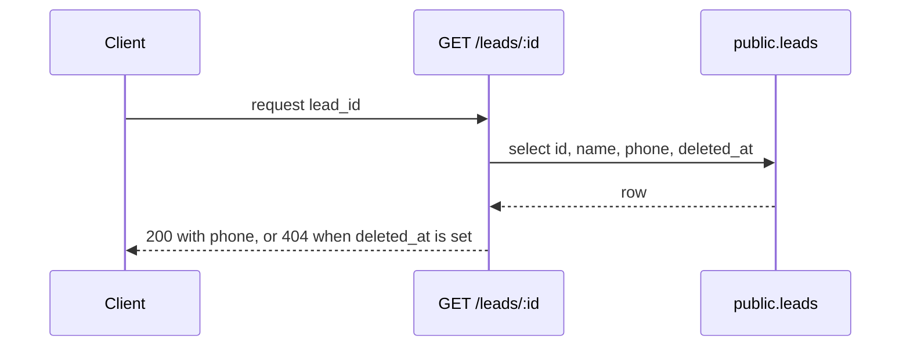

# The body shape

A pull request body carries six parts, in this order. A repo template can add parts. It does not
remove these.

| Part | Purpose |
|---|---|
| Labels checklist | Proves the four labels are set |
| Summary | What changes, and why |
| How It Works | The mermaid diagram, plus the mechanism in prose |
| Linked issues / ADRs | `Resolves #123`, ADR references |
| Testing evidence | The commands you ran, and their output |
| Notes for reviewers | Risk, follow-up work, what you did not do |

---

## What each part holds

### Labels checklist

Four checkboxes, one per label slot. Write the label you set, not a tick alone. This makes a missing
label visible in review. Read [labels](labels.md).

### Summary

Bullets. One idea per bullet. Say what the change does and why it exists. Name the files, tables,
endpoints, and flags that move.

Do not paste the diff. Do not restate the title.

### How It Works

The mermaid block, then two to five sentences that walk the reader through it. The diagram shows the
shape. The prose says what changed inside that shape. Read [diagrams](diagrams.md).

When the repo holds a `docs/diagrams/` directory, commit the same text as a `.mmd` file and
reference it under the block:

```
Diagram source: docs/diagrams/<issue>-<slug>.mmd
```

### Linked issues / ADRs

Use `Resolves #123` or `Part of #123`. GitHub links and closes on those keywords. Add ADR numbers
when a decision record covers the change.

### Testing evidence

List the commands. Paste the output, or the last lines of it. A checkbox with no output proves
nothing.

### Notes for reviewers

The risk you know about. The follow-up you deferred. The thing you could not test. Write this part
even when it is short — an empty section tells the reviewer you thought about it and found nothing.

---

## Copy-paste skeleton

Adjust the command names and the label values for the repo.

````markdown
## Labels
- [ ] Type: `enhancement`
- [ ] Priority: `priority:high`
- [ ] Size: `t-shirt:small`
- [ ] Area: `area:api`

## Summary
- The migration adds `core.leads.phone`.
- `GET /leads/:id` returns the new column.
- The endpoint returns 404 for a soft-deleted `lead`.

## How It Works



The route selects `phone` in the same query. It reads `deleted_at` from that row. It returns 404
when `deleted_at` holds a value.

## Linked Issues / ADRs
- Resolves: #786

## Testing Evidence
- `pnpm lint`
- `pnpm type-check`
- `pnpm test`

```
<paste the output here>
```

## Notes for Reviewers
- The column is nullable. No backfill runs in this PR.
- The client UI does not show `phone` yet. That work is #791.
````

---

## Post the body from a file

Write the body to a file. Pass the file to `gh`. A shell-quoted `-b` argument breaks on backticks,
newlines, and `$`.

```bash
gh pr create --title "feat(api): return phone on the lead endpoint" \
  --body-file /tmp/pr-body.md \
  --label enhancement --label priority:high --label t-shirt:small --label area:api

gh pr edit 812 --body-file /tmp/pr-body.md
```

Open the PR page after you post. Confirm that the diagram renders as an image. Read
[diagrams](diagrams.md) for why no CI job does that for you.
