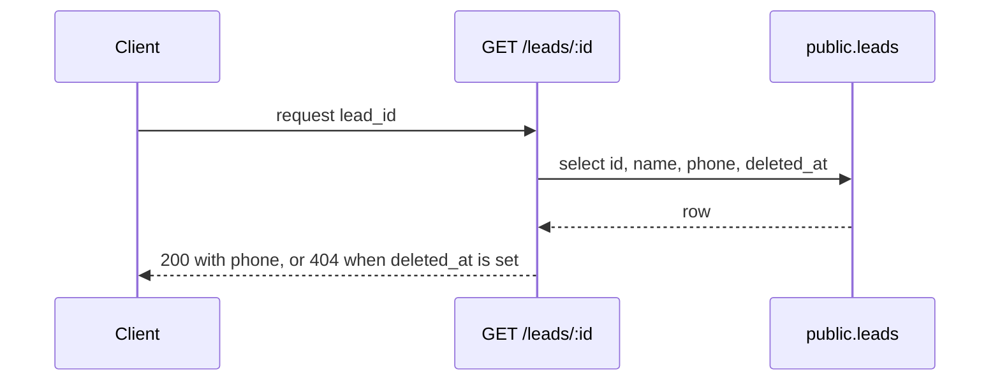

# The diagram

Every pull request carries a mermaid diagram in the body. GitHub renders a fenced `mermaid` block as an
image. No external tool and no image host are involved.

The diagram shows how the change works: the data flow, the sequence of calls, or the architecture of
the pieces this PR touches. Scope it to those pieces. Do not redraw the system.

---

## Which type

| Change | Diagram |
|---|---|
| Request or response flow | `sequenceDiagram` |
| Branching logic, pipeline, or state | `flowchart` |
| Schema or migration change | the flow diagram **and** an `erDiagram` |

An `erDiagram` for a schema change is a **delta**. Draw only the tables, columns, foreign keys, and
views that this PR adds or alters. Leave the repo's full-picture ERD files as they are.

---

## Commit the source when the repo keeps diagram sources

A body is not searchable from a checkout, and it goes stale. When the repo holds a `docs/diagrams/`
directory, commit the same diagram text as a `.mmd` file and reference it under the block:

```
Diagram source: docs/diagrams/<issue>-<slug>.mmd
```

Copy the identical text into both places. A diagram that differs between the body and the `.mmd`
misleads the next reader.

Read the repo's `CLAUDE.md` before you commit the file. Some repos require frontmatter on line 1,
generate their own index, and fail a PR that edits that index by hand.

---

## Three mermaid patterns that break GitHub

GitHub renders unparseable mermaid as a plain code block. It prints no error, so nobody notices.

### 1. A `;` inside note or message text

Mermaid reads `;` as a statement terminator. `strips quotes; caps length` ends the statement at the
`;`.

```
Note over Route: strips quotes; caps length     %% breaks
Note over Route: strips quotes and caps length  %% renders
```

Use "and", or a comma.

### 2. HTML in a participant alias

A `<br/>` inside an alias breaks the diagram.

```
participant Route as Upload route<br/>(session or PAT branch)   %% breaks
participant Route as Upload route (session or PAT branch)       %% renders
```

Write the alias on one line with no tag.

### 3. A bare `%%` line

The comment stripper needs one character after `%%`. A bare `%%` survives and glues onto the next
line. This breaks flowcharts. It does not break sequence diagrams.

```
%%       %% breaks a flowchart
%% ---   %% safe separator
```

---

## No CI job reads your PR body

Two gaps, and both matter.

1. **No job ever sees the description.** A linter that parses committed `.mmd` files never opens the
   PR body. The body is unchecked.
2. **A parser is not a renderer.** Mermaid's own grammar accepts text that GitHub still refuses to
   draw. The `<br/>` alias above parses clean and renders as a code block.

So a green CI run is not proof that your diagram renders. Open the PR page and look at it. When you
see a grey code block instead of an image, the diagram is broken.

---

## Example



The prose inside a diagram follows the same six writing rules as the body. Read
[writing-rules](writing-rules.md).
